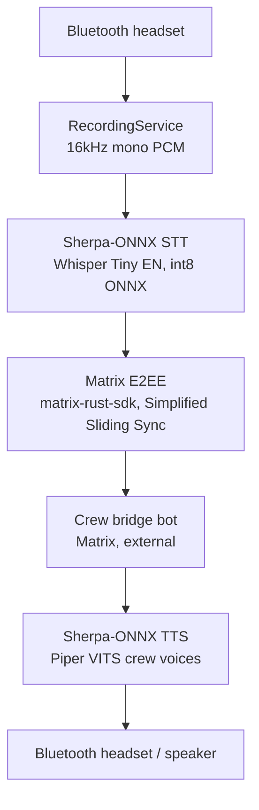

# DeckChat

Android voice client for the AI crew at sea. Offline STT/TTS, E2EE Matrix, no cloud speech processing.

## Overview

DeckChat is your voice line to the crew. Press the headset button, hail the
bridge, and your words are transcribed on-device by Sherpa-ONNX, carried
below decks over E2EE Matrix, and the crew's reply spoken back in their own
voice — your voice never leaves the ship.

## Architecture



| Component | Implementation | License |
|-----------|---------------|---------|
| STT | Sherpa-ONNX + Whisper Tiny EN int8 ONNX | Apache 2.0 |
| TTS | Sherpa-ONNX + Piper VITS voice models | Apache 2.0 / MIT |
| Matrix | matrix-rust-sdk (UniFFI Kotlin bindings) | Apache 2.0 |
| Credentials | Android Keystore (EncryptedSharedPreferences) | — |
| Audio | Android AudioRecord/AudioTrack, Bluetooth SCO | — |

### Crew voices

| Crew | Voice model | Accent |
|------|------------|--------|
| Maren | `vits-piper-en_GB-cori-high` | British English |
| Crest | `vits-piper-en_US-lessac-high` | US English |

### Android targets

| Target | Version |
|--------|---------|
| minSdk | 28 |
| targetSdk | 36 |
| compileSdk | 36 |
| Java | 17 |

## Development

### Prerequisites

- [Nix](https://nixos.org/download/) with flakes enabled
- [devenv](https://devenv.sh/) (recommended — provides convenience scripts below)

### Dev shell

```bash
devenv shell        # recommended — includes convenience scripts
nix develop         # alternative — Gradle + SDK only, no convenience scripts
```

`devenv shell` provides JDK 17, Gradle, Android SDK (build-tools 36, platform 36),
`adb`, and convenience scripts. On entry it prints all available commands.
`nix develop` provides the same toolchain but without the devenv scripts —
use `./gradlew` and `adb` commands directly.

> **Note:** Commands like `install-debug`, `device-test`, `logcat`, `devices`,
> and `download-models` are devenv convenience scripts. `nix develop` users
> can use the underlying `./gradlew` and `adb` equivalents shown in their
> descriptions.

### Emulator

The dev shell includes an Android emulator (API 35, x86_64). KVM is required
for hardware acceleration:

```bash
sudo usermod -aG kvm $USER    # one-time setup (requires logout/login)
emulator                       # creates AVD on first run, then launches
```

SettingsActivity, HeadsetButtonReceiver, and permission-denial tests run on emulator.
Bluetooth and microphone-dependent tests skip (no mic/BT hardware).

### Building

```bash
./gradlew assembleDebug     # debug APK
install-debug               # build + install to connected device
```

### Testing

```bash
./gradlew lint test          # lint + unit tests (no device needed)
device-test                  # instrumented tests on connected device
```

Unit tests use mock engines (`MockSttEngine`, `MockTtsEngine`) — no JNI or
model files required. Instrumented tests require a connected device or emulator.

### Models

STT and TTS models are not committed to the repo (~200 MB total). Download
them before building for real device use:

```bash
download-models                                          # devenv shell
scripts/download-stt-models.sh && scripts/download-tts-models.sh  # nix develop
```

This fetches:
- **STT**: Whisper Tiny EN int8 ONNX (~37 MB) from HuggingFace
- **TTS**: Piper VITS voices (~80 MB each) from k2-fsa/sherpa-onnx releases

Models are placed in `app/src/main/assets/stt/` and `app/src/main/assets/tts/`
(both gitignored).

### Physical device

Connect a device via USB with USB debugging enabled:

```bash
devices                      # list connected devices
install-debug                # build + install
logcat                       # filtered log output for DeckChat
```

`logcat` detects no-device, unauthorized, and multi-device states with
actionable messages. Set `ANDROID_SERIAL` to target a specific device when
multiple are connected.

### Other commands

```bash
wrapper                      # regenerate Gradle wrapper (9.4.0)
check-gms                    # audit for Google Play Services deps (F-Droid)
```

## Project structure

```
./
├── app/
│   └── src/main/java/dev/klazomenai/deckchat/
│       ├── MainActivity.kt              # launch activity
│       ├── SettingsActivity.kt          # Matrix credentials + preferences
│       ├── SecureStorage.kt             # Android Keystore wrapper
│       ├── CrewRegistry.kt              # crew member definitions + voice mapping
│       ├── MatrixClient.kt              # Matrix client interface + crew message parsing
│       ├── RustMatrixClient.kt          # matrix-rust-sdk implementation
│       ├── SttEngine.kt                 # STT interface
│       ├── SherpaOnnxSttEngine.kt       # Sherpa-ONNX Whisper wrapper (JNI)
│       ├── TtsEngine.kt                 # TTS interface
│       ├── SherpaOnnxTtsEngine.kt       # Sherpa-ONNX Piper wrapper (JNI)
│       ├── RecordingService.kt          # foreground service, 16kHz PCM capture
│       ├── HeadsetButtonReceiver.kt     # media button broadcast receiver
│       └── DeckChatAudioManager.kt      # Bluetooth SCO + audio routing
└── scripts/
    ├── download-stt-models.sh           # fetch Whisper models from HuggingFace
    └── download-tts-models.sh           # fetch Piper voices from k2-fsa releases
```

## Privacy

What's said aboard stays aboard. Voice is transcribed and spoken entirely
on-device — no whisper reaches open water. Matrix messages are end-to-end
encrypted. Session tokens are encrypted with Android Keystore (StrongBox when available).
No telemetry. No analytics. No Google Play Services. No exceptions.

## License

Apache-2.0
